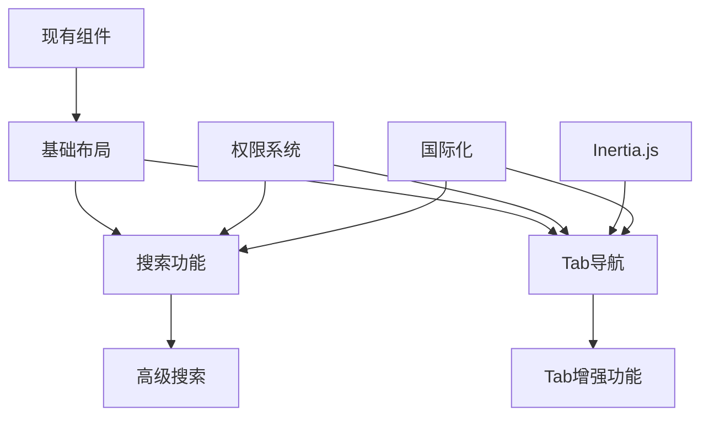

# 顶部菜单栏增强需求文档

## 📋 文档概览

**文档版本**: v2.0  
**最后更新**: 2025年6月  
**维护者**: 开发团队  
**项目**: HYQ MES V2 系统界面增强

---

## 🎯 一、项目背景与目标

### 1.1 背景描述

在当前的应用布局基础上，增强顶部菜单栏功能，提升用户操作体验和界面美观度。当前项目已有基础的AppHeader组件和侧边栏布局，需要在此基础上进行功能扩展和UI优化。

### 1.2 核心目标

- **提升用户效率**：通过Tab导航和全局搜索减少页面跳转
- **优化界面布局**：统一顶部操作区域，提供更好的视觉体验
- **增强功能集成**：整合现有组件，提供一致的交互体验
- **支持多场景**：适配桌面端和移动端不同使用场景

### 1.3 成功指标

- 页面切换效率提升30%
- 用户查找功能时间减少50%
- 界面一致性评分达到90%以上
- 移动端可用性评分达到85%以上

---

## 🏗️ 二、技术架构与选型

### 2.1 技术栈

- **前端框架**：Vue 3 + Composition API + TypeScript
- **页面框架**：Inertia.js
- **UI组件库**：reka-ui（类shadcn设计系统）
- **样式系统**：Tailwind CSS
- **图标库**：lucide-vue-next
- **状态管理**：Vue 3 Composables + LocalStorage
- **权限系统**：Spatie Permission（现有）

### 2.2 架构原则

1. **渐进式增强**：在现有基础上逐步添加功能
2. **组件复用**：最大化利用现有组件和设计系统
3. **性能优先**：确保新功能不影响现有性能
4. **可访问性**：遵循WCAG 2.1 AA标准
5. **国际化支持**：与现有i18n系统集成

---

## 🎨 三、界面设计规范

### 3.1 布局结构

```
┌─────────────────────────────────────────────────────────────────┐
│  [☰] [🔍搜索栏]                         [🌐语言] [🌙主题] [👤用户] │
│  左侧功能区                                        右侧工具区    │
├─────────────────────────────────────────────────────────────────┤
│  [首页] [订单管理] [生产管理] [质量检测] [设置] +              [×] │
│  Tab导航区（类似浏览器标签）                                    │
└─────────────────────────────────────────────────────────────────┘
```

### 3.2 视觉设计规范

#### 尺寸规范
- **顶部菜单栏高度**：`h-14` (56px)
- **Tab导航高度**：`h-10` (40px)
- **组件间距**：`gap-2` (8px)
- **内边距**：`px-4` (16px)

#### 颜色系统
- 使用现有的设计token
- 支持浅色/深色主题自动适配
- 高对比度模式支持

#### 动画效果
- **Tab切换**：`transition-all duration-200 ease-in-out`
- **搜索栏展开**：`transition-width duration-300 ease-out`
- **主题切换**：`transition-colors duration-200`

### 3.3 响应式设计

#### 桌面端（lg及以上）
- 完整功能布局
- 所有工具栏组件可见
- Tab导航完全展开

#### 移动端（lg以下）
- 简化布局，工具栏收纳到Sheet中
- 搜索功能保留但样式调整
- Tab导航支持滑动

---

## 🚀 四、核心功能需求（按优先级排序）

### 4.1 P0 - 基础布局重构

#### 4.1.1 顶部菜单栏主组件

**依赖关系**：无  
**实施优先级**：最高  

```vue
<!-- TopMenuBar.vue -->
<template>
  <header class="top-menu-bar border-b bg-background">
    <!-- 桌面端布局 -->
    <div class="hidden lg:flex w-full items-center justify-between px-4 h-14">
      <!-- 左侧功能区 -->
      <div class="flex items-center gap-2">
        <SidebarTrigger />
        <SearchBar />
      </div>
      
      <!-- 右侧工具区 -->
      <div class="flex items-center gap-2">
        <LanguageToggle />
        <ThemeToggle />
        <UserMenu />
      </div>
    </div>

    <!-- 移动端布局 -->
    <div class="flex lg:hidden w-full items-center justify-between px-4 h-14">
      <SidebarTrigger />
      <MobileToolsMenu />
    </div>

    <!-- Tab导航区 -->
    <TabNavigation />
  </header>
</template>
```

#### 4.1.2 现有组件集成

**依赖关系**：基础布局  
**实施优先级**：高  

- **SidebarTrigger**：直接使用现有组件
- **LanguageSwitcher**：简化为LanguageToggle
- **AppearanceTabs**：简化为ThemeToggle
- **UserMenuContent**：保持现有功能

### 4.2 P0 - 基础搜索功能

#### 4.2.1 搜索栏组件

**依赖关系**：基础布局  
**实施优先级**：高  

```vue
<!-- SearchBar.vue -->
<script setup lang="ts">
import { useGlobalSearch } from '@/composables/useGlobalSearch';
import { useTopMenuPermissions } from '@/composables/useTopMenuPermissions';

const { canAccessSearch } = useTopMenuPermissions();
const { 
  searchQuery, 
  searchResults, 
  isSearchOpen, 
  performGlobalSearch 
} = useGlobalSearch();
</script>

<template>
  <div v-if="canAccessSearch" class="relative">
    <!-- 搜索触发器 -->
    <Button
      variant="outline"
      class="w-64 justify-start text-muted-foreground"
      @click="openSearch"
    >
      <Search class="mr-2 h-4 w-4" />
      搜索页面、订单、产品...
      <kbd class="ml-auto text-xs">⌘K</kbd>
    </Button>

    <!-- 搜索对话框 -->
    <CommandDialog v-model:open="isSearchOpen">
      <CommandInput 
        v-model="searchQuery"
        placeholder="输入搜索内容..."
      />
      <CommandList>
        <CommandEmpty>未找到相关结果</CommandEmpty>
        <CommandGroup 
          v-for="group in groupedResults" 
          :key="group.category"
          :heading="group.title"
        >
          <CommandItem
            v-for="item in group.items"
            :key="item.id"
            @select="navigateToResult(item)"
          >
            <component :is="item.icon" class="mr-2 h-4 w-4" />
            {{ item.title }}
          </CommandItem>
        </CommandGroup>
      </CommandList>
    </CommandDialog>
  </div>
</template>
```

#### 4.2.2 搜索功能实现

**依赖关系**：搜索栏组件、权限系统  
**实施优先级**：高  

```typescript
// composables/useGlobalSearch.ts
export function useGlobalSearch() {
  const searchQuery = useDebouncedRef('', 300);
  const searchResults = ref<SearchResult[]>([]);
  const isSearchOpen = ref(false);
  const searchHistory = useLocalStorage<string[]>('search-history', []);

  // 基础搜索实现
  const performGlobalSearch = async (query: string): Promise<SearchResult[]> => {
    if (!query.trim()) return [];
    
    try {
      // 1. 搜索页面和功能（本地）
      const pageResults = await searchPages(query);
      
      // 2. 搜索数据（API调用）
      const dataResults = await searchData(query);
      
      const allResults = [...pageResults, ...dataResults];
      
      // 添加到搜索历史
      if (!searchHistory.value.includes(query)) {
        searchHistory.value.unshift(query);
        searchHistory.value = searchHistory.value.slice(0, 10);
      }
      
      return allResults;
    } catch (error) {
      console.error('搜索失败:', error);
      return [];
    }
  };

  return {
    searchQuery,
    searchResults,
    isSearchOpen,
    searchHistory,
    performGlobalSearch,
  };
}
```

### 4.3 P1 - Tab导航系统

#### 4.3.1 Tab导航核心组件

**依赖关系**：基础布局、路由系统  
**实施优先级**：中高  

```typescript
// types/navigation.ts
export interface TabItem {
  id: string;
  title: string;
  href: string;
  isActive: boolean;
  isDirty?: boolean;
  isClosable?: boolean;
  icon?: LucideIcon;
  lastAccessed?: number;
}

// composables/useTabNavigation.ts
export function useTabNavigation() {
  const tabs = ref<TabItem[]>([]);
  const activeTabId = ref<string | null>(null);
  const maxTabs = ref(12);

  const addTab = (tab: Omit<TabItem, 'id'>) => {
    // 检查是否已存在
    const existingTab = tabs.value.find(t => t.href === tab.href);
    if (existingTab) {
      switchTab(existingTab.id);
      return;
    }

    // 检查数量限制
    if (tabs.value.length >= maxTabs.value) {
      // 移除最久未访问的Tab
      const oldestTab = tabs.value
        .filter(t => t.isClosable !== false)
        .sort((a, b) => (a.lastAccessed || 0) - (b.lastAccessed || 0))[0];
      
      if (oldestTab) {
        removeTab(oldestTab.id);
      }
    }

    const newTab: TabItem = {
      ...tab,
      id: generateTabId(),
      lastAccessed: Date.now(),
    };

    tabs.value.push(newTab);
    switchTab(newTab.id);
  };

  const removeTab = (tabId: string) => {
    const index = tabs.value.findIndex(t => t.id === tabId);
    if (index === -1) return;

    const wasActive = tabs.value[index].isActive;
    tabs.value.splice(index, 1);

    // 如果关闭的是当前Tab，切换到相邻Tab
    if (wasActive && tabs.value.length > 0) {
      const nextIndex = Math.min(index, tabs.value.length - 1);
      switchTab(tabs.value[nextIndex].id);
    }
  };

  const switchTab = (tabId: string) => {
    tabs.value.forEach(tab => {
      tab.isActive = tab.id === tabId;
      if (tab.isActive) {
        tab.lastAccessed = Date.now();
      }
    });
    activeTabId.value = tabId;
  };

  return {
    tabs: readonly(tabs),
    activeTabId: readonly(activeTabId),
    addTab,
    removeTab,
    switchTab,
  };
}
```

#### 4.3.2 Inertia.js路由集成

**依赖关系**：Tab导航核心、Inertia.js  
**实施优先级**：中高  

```typescript
// composables/useInertiaTabNavigation.ts
import { router, usePage } from '@inertiajs/vue3';
import { route } from 'ziggy-js';

export function useInertiaTabNavigation() {
  const page = usePage();
  const { addTab, switchTab } = useTabNavigation();

  const navigateToTab = (tabHref: string) => {
    router.get(tabHref, {}, {
      preserveState: true,
      preserveScroll: true,
      onSuccess: () => {
        updateActiveTab(tabHref);
      }
    });
  };

  const openInNewTab = (routeName: string, params: Record<string, any> = {}) => {
    const href = route(routeName, params);
    const tabItem: Omit<TabItem, 'id'> = {
      title: getPageTitle(routeName, params),
      href,
      isActive: false,
      isClosable: true,
      icon: getRouteIcon(routeName),
    };
    
    addTab(tabItem);
    navigateToTab(href);
  };

  // 页面标题映射
  const getPageTitle = (routeName: string, params: Record<string, any>) => {
    const titleMap: Record<string, string> = {
      'dashboard': '仪表板',
      'orders.index': '订单管理',
      'orders.show': `订单详情 #${params.order}`,
      'products.index': '产品管理',
      'customers.index': '客户管理',
      'settings.profile': '个人设置',
    };
    
    return titleMap[routeName] || routeName;
  };

  return {
    navigateToTab,
    openInNewTab,
    currentUrl: computed(() => page.url),
  };
}
```

### 4.4 P2 - 权限控制集成

#### 4.4.1 权限检查组合式函数

**依赖关系**：现有权限系统  
**实施优先级**：中  

```typescript
// composables/useTopMenuPermissions.ts
export function useTopMenuPermissions() {
  const { user } = useAuth();
  const { currentTeam } = useTeam();
  
  const canAccessSearch = computed(() => {
    // 根据用户权限决定是否显示搜索功能
    return user.value?.hasPermissionInTeam(
      currentTeam.value?.id, 
      'view_global_search'
    ) ?? true; // 默认允许搜索
  });
  
  const canManageTeam = computed(() => {
    return user.value?.hasPermissionInTeam(
      currentTeam.value?.id, 
      'manage_team_members'
    ) ?? false;
  });
  
  const availableModules = computed(() => {
    const modules = ['orders', 'products', 'customers', 'reports'];
    return modules.filter(module => 
      user.value?.hasPermissionInTeam(
        currentTeam.value?.id, 
        `view_${module}`
      ) ?? false
    );
  });
  
  const canAccessModule = (module: string) => {
    return user.value?.hasPermissionInTeam(
      currentTeam.value?.id, 
      `view_${module}`
    ) ?? false;
  };
  
  return {
    canAccessSearch,
    canManageTeam,
    availableModules,
    canAccessModule,
  };
}
```

---

## 🔧 五、高级功能需求

### 5.1 P2 - 搜索功能增强

#### 5.1.1 多数据源搜索

**依赖关系**：基础搜索功能  
**实施优先级**：中  

```typescript
// composables/useAdvancedSearch.ts
export interface SearchProvider {
  name: string;
  search: (query: string) => Promise<SearchResult[]>;
  icon: LucideIcon;
  enabled: boolean;
}

export function useAdvancedSearch() {
  const { canAccessModule } = useTopMenuPermissions();
  
  // 动态搜索提供者（基于权限）
  const searchProviders = computed<SearchProvider[]>(() => [
    {
      name: 'pages',
      search: searchPages,
      icon: FileText,
      enabled: true,
    },
    {
      name: 'orders',
      search: searchOrders,
      icon: ShoppingCart,
      enabled: canAccessModule('orders'),
    },
    {
      name: 'products',
      search: searchProducts,
      icon: Package,
      enabled: canAccessModule('products'),
    },
    {
      name: 'customers',
      search: searchCustomers,
      icon: Users,
      enabled: canAccessModule('customers'),
    },
  ].filter(provider => provider.enabled));

  const performGlobalSearch = async (query: string): Promise<SearchResult[]> => {
    if (!query.trim()) return [];
    
    try {
      // 并行搜索所有启用的数据源
      const searchPromises = searchProviders.value.map(provider => 
        provider.search(query).catch(() => [])
      );
      
      const results = await Promise.all(searchPromises);
      return results.flat();
    } catch (error) {
      console.error('搜索失败:', error);
      return [];
    }
  };

  return {
    searchProviders,
    performGlobalSearch,
  };
}
```

### 5.2 P2 - Tab导航增强功能

#### 5.2.1 Tab拖拽重排序

**依赖关系**：Tab导航核心  
**实施优先级**：中  

```vue
<!-- TabDragHandler.vue -->
<script setup lang="ts">
import { useSortable } from '@vueuse/integrations/useSortable';

const props = defineProps<{
  tabs: TabItem[];
}>();

const emit = defineEmits<{
  reorder: [fromIndex: number, toIndex: number];
}>();

const tabsContainer = ref<HTMLElement>();

const { start, stop } = useSortable(tabsContainer, props.tabs, {
  animation: 200,
  onUpdate: (e) => {
    emit('reorder', e.oldIndex!, e.newIndex!);
  },
});

onMounted(() => start());
onUnmounted(() => stop());
</script>

<template>
  <div ref="tabsContainer" class="flex">
    <slot />
  </div>
</template>
```

#### 5.2.2 Tab右键菜单

**依赖关系**：Tab导航核心  
**实施优先级**：中  

```vue
<!-- TabContextMenu.vue -->
<script setup lang="ts">
const props = defineProps<{
  tab: TabItem;
}>();

const emit = defineEmits<{
  close: [tabId: string];
  closeOthers: [tabId: string];
  closeAll: [];
  duplicate: [tab: TabItem];
}>();

const menuItems = computed(() => [
  {
    label: '关闭标签',
    action: () => emit('close', props.tab.id),
    disabled: !props.tab.isClosable,
    shortcut: 'Ctrl+W',
  },
  {
    label: '关闭其他标签',
    action: () => emit('closeOthers', props.tab.id),
  },
  {
    label: '关闭所有标签',
    action: () => emit('closeAll'),
  },
  { type: 'separator' },
  {
    label: '复制标签',
    action: () => emit('duplicate', props.tab),
  },
]);
</script>

<template>
  <ContextMenu>
    <ContextMenuTrigger>
      <slot />
    </ContextMenuTrigger>
    <ContextMenuContent>
      <template v-for="item in menuItems" :key="item.label || 'separator'">
        <ContextMenuSeparator v-if="item.type === 'separator'" />
        <ContextMenuItem 
          v-else
          :disabled="item.disabled"
          @click="item.action"
        >
          {{ item.label }}
          <ContextMenuShortcut v-if="item.shortcut">
            {{ item.shortcut }}
          </ContextMenuShortcut>
        </ContextMenuItem>
      </template>
    </ContextMenuContent>
  </ContextMenu>
</template>
```

### 5.3 P3 - 国际化支持

#### 5.3.1 多语言配置

**依赖关系**：现有i18n系统  
**实施优先级**：低  

```typescript
// i18n/locales/zh-CN/topMenu.json
{
  "search": {
    "placeholder": "搜索页面、订单、产品...",
    "noResults": "未找到相关结果",
    "recentSearches": "最近搜索",
    "suggestions": "搜索建议",
    "shortcut": "Ctrl+K"
  },
  "tabs": {
    "close": "关闭标签",
    "closeOthers": "关闭其他标签",
    "closeAll": "关闭所有标签",
    "newTab": "新建标签",
    "maxTabsReached": "已达到最大标签数量限制"
  },
  "theme": {
    "light": "浅色主题",
    "dark": "深色主题",
    "system": "跟随系统"
  },
  "user": {
    "profile": "个人资料",
    "settings": "设置",
    "logout": "退出登录"
  }
}
```

---

## 🛡️ 六、安全与性能

### 6.1 安全考虑

#### 6.1.1 输入验证与XSS防护

```typescript
// utils/topMenuSecurity.ts
export class TopMenuSecurity {
  // 搜索查询清理
  static sanitizeSearchQuery(query: string): string {
    return query
      .replace(/[<>]/g, '') // 移除HTML标签
      .replace(/javascript:/gi, '') // 移除JavaScript协议
      .trim()
      .slice(0, 100); // 限制长度
  }
  
  // Tab URL验证
  static validateTabUrl(url: string): boolean {
    try {
      const urlObj = new URL(url, window.location.origin);
      
      // 只允许同源URL
      if (urlObj.origin !== window.location.origin) {
        return false;
      }
      
      // 检查路径白名单
      const allowedPaths = [
        '/dashboard',
        '/orders',
        '/products',
        '/customers',
        '/settings',
        '/reports',
      ];
      
      return allowedPaths.some(path => urlObj.pathname.startsWith(path));
    } catch {
      return false;
    }
  }
}
```

#### 6.1.2 搜索频率限制

```typescript
// 搜索频率限制
const createSearchRateLimit = () => {
  const requests = new Map<string, number[]>();
  
  return (userId: string): boolean => {
    const now = Date.now();
    const userRequests = requests.get(userId) || [];
    
    // 清理1分钟前的请求
    const recentRequests = userRequests.filter(time => now - time < 60000);
    
    // 限制每分钟最多30次搜索
    if (recentRequests.length >= 30) {
      return false;
    }
    
    recentRequests.push(now);
    requests.set(userId, recentRequests);
    return true;
  };
};
```

### 6.2 性能优化

#### 6.2.1 组件延迟加载

```typescript
// 按需加载重型组件
const SearchDialog = defineAsyncComponent(() => import('@/components/SearchDialog.vue'));
const TabPreview = defineAsyncComponent(() => import('@/components/TabPreview.vue'));
```

#### 6.2.2 状态持久化

```typescript
// composables/useTopMenuPersistence.ts
export function useTopMenuPersistence() {
  const tabState = useLocalStorage('top-menu-tabs', {
    tabs: [] as TabItem[],
    activeTabId: null as string | null,
    settings: {
      maxTabs: 12,
      enableDragReorder: true,
    },
  });
  
  // 定期清理过期数据
  const cleanupExpiredData = () => {
    const oneWeekAgo = Date.now() - 7 * 24 * 60 * 60 * 1000;
    
    tabState.value.tabs = tabState.value.tabs.filter(
      tab => (tab.lastAccessed || Date.now()) > oneWeekAgo
    );
  };
  
  onMounted(() => {
    cleanupExpiredData();
  });
  
  return {
    tabState,
    cleanupExpiredData,
  };
}
```

---

## 🧪 七、测试策略

### 7.1 单元测试

```typescript
// tests/unit/TabNavigation.test.ts
describe('TabNavigation', () => {
  it('应该能够添加新标签页', () => {
    const { addTab, tabs } = useTabNavigation();
    
    addTab({
      title: '测试标签',
      href: '/test',
      isActive: false,
      isClosable: true,
    });
    
    expect(tabs.value).toHaveLength(1);
    expect(tabs.value[0].title).toBe('测试标签');
  });
  
  it('应该限制最大标签页数量', () => {
    const { addTab, tabs, maxTabs } = useTabNavigation();
    maxTabs.value = 2;
    
    // 添加3个标签页
    for (let i = 0; i < 3; i++) {
      addTab({
        title: `标签${i}`,
        href: `/test${i}`,
        isActive: false,
        isClosable: true,
      });
    }
    
    expect(tabs.value).toHaveLength(2);
  });
});
```

### 7.2 E2E测试

```typescript
// tests/e2e/topMenuBar.spec.ts
test('用户可以通过搜索功能导航', async ({ page }) => {
  await page.goto('/dashboard');
  
  // 打开搜索
  await page.keyboard.press('Control+K');
  await expect(page.locator('[data-testid="search-dialog"]')).toBeVisible();
  
  // 搜索订单
  await page.fill('[data-testid="search-input"]', '订单');
  await page.click('[data-testid="search-result-orders"]');
  
  // 验证导航成功
  await expect(page).toHaveURL('/orders');
  
  // 验证Tab已添加
  await expect(page.locator('[data-testid="tab-orders"]')).toBeVisible();
});
```

---

## 📦 八、实施计划

### 8.1 开发阶段划分

#### 阶段一：基础架构（2-3天）
**目标**：建立核心组件和基础布局

- [ ] 创建TopMenuBar主组件
- [ ] 重构现有AppHeader组件
- [ ] 集成SidebarTrigger和现有工具组件
- [ ] 建立基础样式和响应式布局

**交付物**：
- TopMenuBar.vue组件
- 基础样式文件
- 响应式布局测试

#### 阶段二：搜索功能（2-3天）
**目标**：实现基础搜索功能

- [ ] 开发SearchBar组件
- [ ] 实现基础搜索逻辑
- [ ] 添加快捷键支持
- [ ] 集成权限控制

**交付物**：
- SearchBar.vue组件
- useGlobalSearch composable
- 搜索API接口

#### 阶段三：Tab导航（3-4天）
**目标**：实现Tab导航核心功能

- [ ] 开发Tab导航组件库
- [ ] 实现Tab状态管理
- [ ] 集成Inertia.js路由
- [ ] 添加基础交互功能

**交付物**：
- TabNavigation组件库
- useTabNavigation composable
- 路由集成逻辑

#### 阶段四：功能完善（2-3天）
**目标**：添加高级功能和优化

- [ ] 实现Tab拖拽重排序
- [ ] 添加右键菜单
- [ ] 完善搜索功能
- [ ] 性能优化

**交付物**：
- 完整功能组件
- 性能优化报告
- 用户体验测试

#### 阶段五：测试与部署（1-2天）
**目标**：确保质量和稳定性

- [ ] 单元测试编写
- [ ] E2E测试编写
- [ ] 无障碍功能测试
- [ ] 性能测试

**交付物**：
- 完整测试套件
- 部署文档
- 用户手册

### 8.2 里程碑检查点

| 里程碑 | 时间点 | 检查内容 | 成功标准 |
|--------|--------|----------|----------|
| M1 | 第3天 | 基础布局完成 | 顶部菜单栏正常显示，响应式布局工作 |
| M2 | 第6天 | 搜索功能可用 | 搜索功能正常，快捷键工作 |
| M3 | 第10天 | Tab导航完成 | Tab添加/关闭/切换功能正常 |
| M4 | 第13天 | 功能完善 | 所有高级功能工作正常 |
| M5 | 第15天 | 测试完成 | 所有测试通过，性能达标 |

---

## ✅ 九、验收标准

### 9.1 功能完整性

#### 核心功能
- [ ] 顶部菜单栏正确显示和布局
- [ ] 侧边栏展开/收起按钮正常工作
- [ ] 搜索栏支持快捷键打开和全局搜索
- [ ] 语言切换器集成并简化显示
- [ ] 主题切换器支持一键切换
- [ ] 用户菜单保持现有功能

#### Tab导航功能
- [ ] Tab导航支持添加、关闭、切换
- [ ] Tab重排序功能正常
- [ ] Tab右键菜单功能完整
- [ ] Tab数量限制机制工作
- [ ] Tab状态持久化正常

#### 权限控制
- [ ] 搜索功能根据权限显示/隐藏
- [ ] 模块访问权限正确过滤
- [ ] 团队切换时权限正确更新

### 9.2 性能标准

- [ ] 首次加载时间不超过当前版本的110%
- [ ] Tab切换响应时间小于100ms
- [ ] 搜索响应时间小于300ms
- [ ] 内存使用量在合理范围内
- [ ] 无内存泄漏问题

### 9.3 用户体验

- [ ] 所有快捷键功能正常
- [ ] 动画效果流畅自然
- [ ] 无障碍功能完备
- [ ] 多语言支持正常
- [ ] 主题切换无闪烁

### 9.4 兼容性

- [ ] 支持Chrome、Firefox、Safari、Edge最新版本
- [ ] 移动端Safari和Chrome正常显示
- [ ] 触摸设备交互正常
- [ ] 键盘导航完整支持

### 9.5 安全性

- [ ] 搜索输入正确清理和验证
- [ ] Tab URL验证机制工作
- [ ] 权限检查无绕过漏洞
- [ ] 无XSS安全风险

---

## ⚠️ 十、风险评估与缓解

### 10.1 技术风险

| 风险项 | 影响程度 | 发生概率 | 缓解策略 |
|--------|----------|----------|----------|
| Tab导航内存泄漏 | 高 | 中 | 实施严格的Tab数量限制和自动清理机制 |
| 搜索性能问题 | 中 | 中 | 实施防抖、缓存和分页策略 |
| 权限检查失效 | 高 | 低 | 多层权限验证和降级方案 |
| 浏览器兼容性 | 中 | 低 | 渐进式增强和polyfill支持 |
| Inertia.js集成问题 | 中 | 中 | 充分测试路由状态管理 |

### 10.2 用户体验风险

| 风险项 | 影响程度 | 发生概率 | 缓解策略 |
|--------|----------|----------|----------|
| 学习成本过高 | 中 | 中 | 提供引导教程和帮助文档 |
| 操作复杂度增加 | 中 | 中 | 保持简洁的默认状态，高级功能可选 |
| 移动端体验差 | 高 | 中 | 响应式设计和触摸优化 |
| 功能发现性差 | 中 | 中 | 明确的视觉提示和快捷键显示 |

### 10.3 业务风险

| 风险项 | 影响程度 | 发生概率 | 缓解策略 |
|--------|----------|----------|----------|
| 开发周期延长 | 中 | 中 | 分阶段实施，核心功能优先 |
| 维护成本增加 | 中 | 高 | 完善的文档和测试覆盖 |
| 用户接受度低 | 高 | 低 | 用户测试和反馈收集 |
| 现有功能回归 | 高 | 低 | 充分的回归测试 |

---

## 🔮 十一、后续优化方向

### 11.1 短期优化（1-3个月）
- 收集用户使用数据和反馈
- 优化搜索算法和结果排序
- 完善移动端体验
- 增加更多快捷键支持
- 添加使用统计和分析

### 11.2 中期优化（3-6个月）
- 实施AI驱动的智能搜索建议
- 添加Tab预览和缩略图功能
- 集成工作流程快捷操作
- 支持自定义工具栏布局
- 添加搜索结果排序和过滤

### 11.3 长期优化（6-12个月）
- 实现跨设备Tab同步
- 添加语音搜索功能
- 集成第三方应用和插件
- 支持个性化推荐和智能助手
- 实现协作功能（共享Tab等）

---

## 📚 十二、附录

### 12.1 依赖关系图



### 12.2 组件依赖关系

```typescript
// 组件依赖层次
TopMenuBar
├── SidebarTrigger (现有)
├── SearchBar
│   ├── useGlobalSearch
│   ├── useTopMenuPermissions
│   └── CommandDialog (reka-ui)
├── LanguageToggle (简化版LanguageSwitcher)
├── ThemeToggle (简化版AppearanceTabs)
├── UserMenu (现有UserMenuContent)
└── TabNavigation
    ├── useTabNavigation
    ├── useInertiaTabNavigation
    ├── TabItem
    ├── TabContextMenu
    └── TabDragHandler
```

### 12.3 环境变量配置

```env
# .env
# 搜索功能配置
VITE_SEARCH_ENABLED=true
VITE_SEARCH_CACHE_TTL=30
VITE_MAX_SEARCH_RESULTS=10

# Tab导航配置
VITE_MAX_TABS=12
VITE_TAB_PERSISTENCE=true
VITE_TAB_DRAG_ENABLED=true

# 性能配置
VITE_SEARCH_DEBOUNCE_MS=300
VITE_TAB_CLEANUP_INTERVAL=86400000
```

### 12.4 构建优化配置

```typescript
// vite.config.ts
export default defineConfig({
  build: {
    rollupOptions: {
      output: {
        manualChunks: {
          'top-menu': [
            '@/components/TopMenuBar.vue',
            '@/components/SearchBar.vue',
            '@/components/TabNavigation'
          ],
          'search': [
            '@/composables/useGlobalSearch.ts',
            '@/composables/useAdvancedSearch.ts'
          ],
          'tabs': [
            '@/composables/useTabNavigation.ts',
            '@/composables/useInertiaTabNavigation.ts'
          ],
        },
      },
    },
  },
});
```

---

**总预估工期：10-15天**  
**核心功能完成：8-10天**  
**完整功能交付：10-15天**

如需进一步细化特定功能的实现方案，请根据实际开发进度和需求优先级进行调整。

## 动态标签页系统使用指南

### 1. 系统优先级

动态标签页系统按以下优先级获取页面信息：

1. **页面 Props 中的 meta 信息**（最高优先级）
2. **组件名称推导**
3. **URL 路径动态生成**（最低优先级）

### 2. 在后端路由中定义 Meta 信息

```php
// routes/web.php 或 routes/settings.php
Route::get('dashboard', function () {
    return Inertia::render('Dashboard', [
        'meta' => [
            'title' => '仪表板',      // 标签页标题
            'icon' => '📊',          // 标签页图标
            'closable' => false,     // 是否可关闭
        ]
    ]);
})->name('dashboard');

Route::get('settings/profile', function () {
    return Inertia::render('settings/Profile', [
        'meta' => [
            'title' => '个人资料',
            'icon' => '👤',
            'closable' => true,
        ]
    ]);
})->name('profile.edit');
```

### 3. 在页面组件中定义 Meta 信息

```vue
<script setup lang="ts">
// 定义页面 Props 接口
interface Props {
    meta?: {
        title?: string;
        icon?: string;
        closable?: boolean;
    };
}

// 设置默认值（withDefaults 是编译器宏，无需导入）
const props = withDefaults(defineProps<Props>(), {
    meta: () => ({
        title: '默认标题',
        icon: '📄',
        closable: true
    })
});
</script>
```

### 4. 组件名称自动推导

如果没有提供 meta 信息，系统会根据组件名称自动推导：

- `Dashboard` → "仪表板" 📊
- `settings/Profile` → "个人资料" 👤
- `settings/Password` → "密码设置" 🔒
- `UserManagement` → "User Management" 👥

### 5. URL 路径自动生成

作为最后的回退，系统会从 URL 路径自动生成标题：

- `/settings/profile` → "个人资料" 👤
- `/user-management` → "User Management" 👥
- `/reports/sales` → "Sales" 📈

### 6. 动态更新标签页信息

```typescript
import { useTabNavigation } from '@/composables/useTabNavigation';

const { updateTabInfo, activeTabId } = useTabNavigation();

// 在页面组件中动态更新当前标签页
const updateCurrentTab = () => {
    updateTabInfo(activeTabId.value, {
        title: '新标题',
        icon: '🔄'
    });
};
```

### 7. 支持的图标关键词

系统支持根据组件名称和路径自动匹配图标：

- `Dashboard` → 📊
- `Profile`, `User` → 👤
- `Password`, `Security` → 🔒
- `Appearance`, `Theme` → 🎨
- `Settings` → ⚙️
- `Test` → 🔧
- `Demo` → 🧪
- `Report`, `Chart` → 📈
- `Form` → 📝
- `List`, `Table` → 📋

### 8. 扩展性

要添加新的自动识别规则，只需修改 `useTabNavigation.ts` 中的映射对象：

```typescript
// 组件映射
const componentMap: Record<string, { title: string; icon?: string }> = {
    'YourComponent': { title: '你的组件', icon: '🚀' },
    // 添加更多映射...
};

// 图标映射
const iconMap: Record<string, string> = {
    'YourKeyword': '🚀',
    // 添加更多图标...
};
```

这个动态系统确保了：
- 🎯 **灵活性**：支持多种定义方式
- 🔄 **自动化**：无需手动配置即可工作
- 🛠️ **可扩展**：容易添加新的识别规则
- 📱 **一致性**：所有页面都有合适的标题和图标